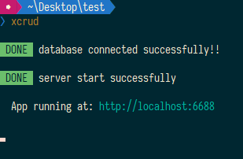
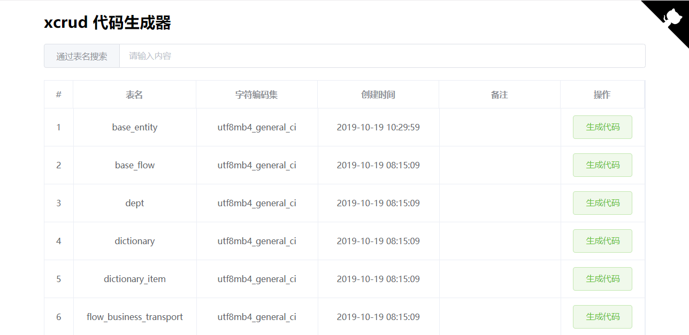
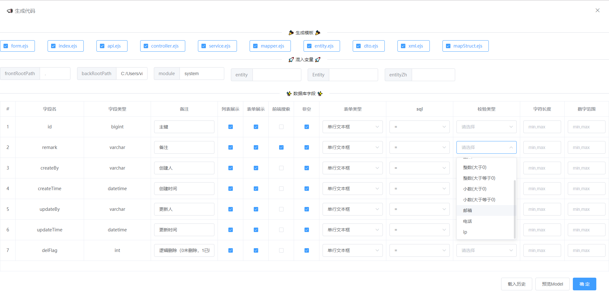
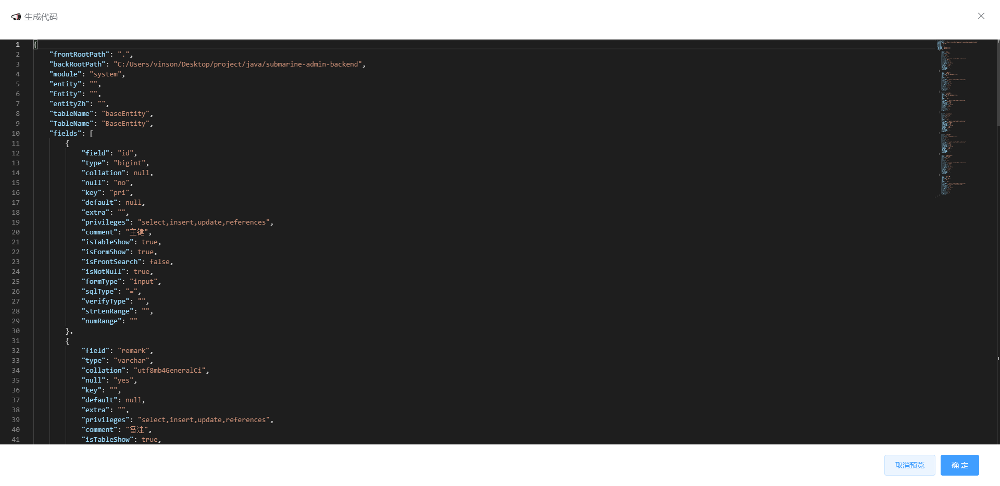

# xcrud-generator

查询数据库表字段，快速生成模板代码，不区分项目语言，前后端都可使用

使用 ejs 模板语法

## 安装

```bash
yarn global add xcrud-generator
# or
npm install xcrud-generator -g
```

## 使用

在项目根目录新建 `xcrud-generator.js` 配置文件，可用配置如下：

```javascript
module.exports = {
    user: 'charles',    // 当前创建人（共享配置时，区分创建人）
    cache: 'db',  // 历史配置存储方式：db、browser(default)
    // 数据库配置
    db: {
        host: '192.168.39.36',
        port: 3306,
        user: 'root',
        password: 'root',
        database: 'submarine'
    },
    // 直接混入的参数（可选）
    mixin: {
        package: "org.xcrud",
        entity: ""
    },
    // 自定义数据库字段的信息，自动生成到页面中（可选）
    fields: [
        {
            title: "是否非空",
            name: "isSearch",
            default: false,
            width: "100",
            type: "checkbox"  // checkbox
        },
        {
            title: "启用禁用",
            name: "enable",
            default: "",
            type: "select", // 下拉选择
            options: [
                // 设置下拉选项
                { label: "启用", value: "enable" },
                { label: "冻结", value: "disable" }
            ]
        },
        {
            title: "地址",
            name: "address",
            default: "",
            type: "input", // 输入框
            width: "300",
            placeholder: "请输入地址"
        }
    ],
    // 模板文件夹，只支持ejs语法，模板文件要以ejs为后缀
    input: {
        dir: "./template/"
    },
    // 模板文件输出配置，指定每个模板文件的输出位置
    output: [
        {
            template: "controller.ejs", // 模板文件名
            path: "./gen/<%= tableName %>/controller/Controller.java"  // 当前模板的输出位置，路径支持ejs语法
        },
        {
            template: "dao.ejs",
            path: "./gen/<%= tableName %>/dao/dao.java"
        }
    ]
};
```

配置好文件后，使用命令 `xcrud` 启动服务



打开 `http://localhost:6688` 后，可以看到页面列出了所有的表



点击某张表的生成代码按钮，之前在 `xcrud-generator.js` 中配置的下拉框（启用禁用）和输入框（地址）都展示在弹窗中，并且可勾选要生成的文件，以及填写要混入的变量



对于比较复杂的配置很容易配置出错，通过点击底部的载入历史按钮，可以快速的载入上次的配置，在此基础上继续修改


输入相关的信息后，点击底部的 预览Model 按钮，可以看到一个json，json中的变量都可在 ejs模板 和 生成路径 中使用



点击确定，即可生成代码。（ **注意：** 要在 `xcrud-generator.js` 中配置的`./template/`文件夹下写好 ejs模板 哦）

## 内置函数

内置字符串处理函数，可以在模板中使用

- 下划线转驼峰：`StrUtil.underscoreToCamel(str)`
- 驼峰转下划线：`StrUtil.camelToUnderscore(str)`
- 驼峰转短横线: `StrUtil.camelToKebab(str)`
- 短横线转驼峰: `StrUtil.kebabToCamel(str)`
- 首字母小写：`StrUtil.initialLowerCase(str)`
- 首字母大写：`StrUtil.initialUpperCase(str)`
- 全部小写：`StrUtil.toLowerCase(str)`
- 全部大写：`StrUtil.toUpperCase(str)`

```java
// 使用示例，模板中可使用的变量 packageName = "xcrudGenerator"

// file.ejs
包名为：<%= StrUtil.camelToUnderscore(packageName) %>

// 输出
包名为：xcrud_generator

```

## 命令行参数

使用 `xcrud --help` 查看帮助

```bash
$ xcrud --help

Usage: app [options]

Options:
  -V, --version            output the version number
  -p, --port <number>      set port (default: 6688)
  -c, --config <fileName>  set profile name (default: "xcrud-generator.js")
  -h, --help               output usage information
```

## 优点

- 无侵入，只需在项目中添加 json 配置文件，写好模板即可
- 自定义参数，根据自身需求，在页面中混入参数
- 动态路径，生成的文件路径可动态生成，支持 ejs 语法

## License

[MIT](http://opensource.org/licenses/MIT)

Copyright (c) 2019-present, charles
